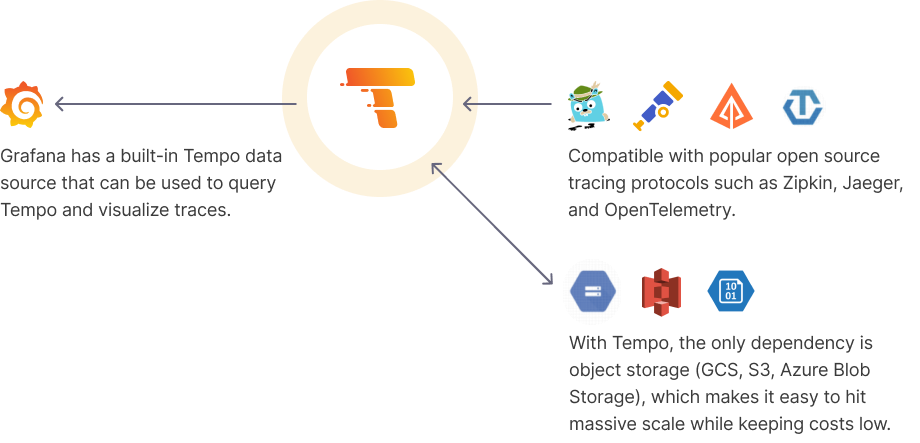
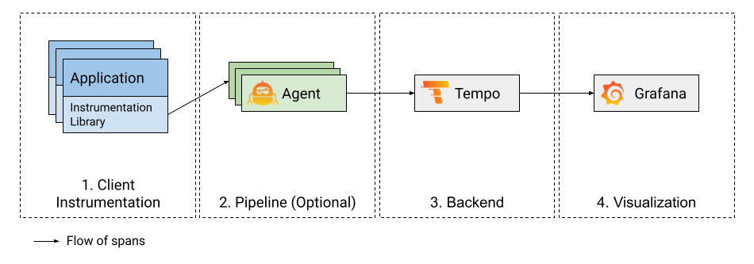

# GRAFANA TEMPO DOCUMENTATION

This repository contains a setup for monitoring three microservices using Grafana, Tempo, Prometheus and Docker Compose.

## Grafana Tempo

Grafana Tempo is an open source, easy-to-use, and high-scale distributed tracing backend. Tempo is cost-efficient, requiring only object storage to operate, and is deeply integrated with Grafana, Prometheus, and Loki. Tempo can ingest common open source tracing protocols, including Jaeger, Zipkin, and OpenTelemetry.

### Why Grafana Tempo?

**Built for massing scale**: The only dependency is object storage which provides affordable long term storage of traces
**Cost-effective**: Not indexing the traces makes it possible to store orders of magnitude more trace data for the same cost
**Strong integration with open source tools**: Compatible with open source tracing protocols

### How does Tempo work?






## Folder Structure

- `/microservices`: Contains the three microservices.
- `/configs`: Configuration files for all services.
- `docker-compose.yaml`: Docker Compose file for running Grafana, Tempo, Prometheus and the three microservices.

## Prerequisites

Make sure you have Docker and Docker Compose installed on your machine.

## Setup and Usage

1. **Clone this repository**:

   ```bash
   git clone https://github.com/Avinash9414/Tempo-Documentation.git
   cd Tempo-Documentation
   ```

2. **Configure the microservices**:
    - Please refer to the README.md file in the `/microservices` folder for instructions on how to configure the microservices.

3. **Configure Tempo as per needs**:
    - Please refer to the README.md file in the `/configs` folder for instructions on how to configure Tempo.

4. **Start the services**:

   ```bash
   docker-compose build
   docker-compose up -d
   ```

5. **Open Grafana in your browser at http://localhost:3000 and login with the following credentials**:

    - Username: `admin`
    - Password: `admin`

6. **Navigate to Dashboards tab**:

    - You will find 2 dashboards:
        - `NodeJS Application Dashboard for Metrics`
        - `Traces Dashboard`
        
    - The first dashboard shows the metrics for the three microservices.
    - The second dashboard shows the traces for the three microservices with a service graph view.

    **You can use these dashboards to monitor the performance of the three microservices.**

## END


