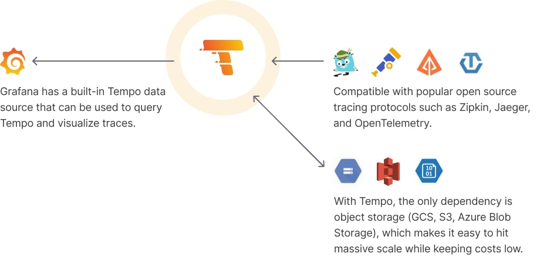
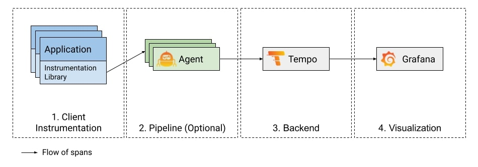

# GRAFANA TEMPO DOCUMENTATION

This repository contains a setup for monitoring three microservices using Grafana, Grafana Tempo, Grafana Alloy, Prometheus, Cadvisor and Docker Compose.

## Grafana Tempo

Grafana Tempo is an open source, easy-to-use, and high-scale distributed tracing backend. Tempo is cost-efficient, requiring only object storage to operate, and is deeply integrated with Grafana, Prometheus, and Loki. Tempo can ingest common open source tracing protocols, including Jaeger, Zipkin, and OpenTelemetry.

### Why Grafana Tempo?

**Built for massing scale**: The only dependency is object storage which provides affordable long term storage of traces
**Cost-effective**: Not indexing the traces makes it possible to store orders of magnitude more trace data for the same cost
**Strong integration with open source tools**: Compatible with open source tracing protocols

### How does Tempo work?




**This diagram illustrates a tracing system configuration**:



For more information about Grafana Tempo and its features, please refer to the [Grafana Tempo documentation](https://grafana.com/docs/tempo/latest/).


## Folder Structure

- `/microservices`: Contains the three microservices.
- `/configs`: Configuration files for all services.
- `docker-compose.yaml`: Docker Compose file for running Grafana, Grafana Tempo, Prometheus, Grafana Alloy, Cadvisor and the three microservices.

## Prerequisites

Make sure you have Docker and Docker Compose installed on your machine.

## Setup and Usage

1. **Clone this repository**:

   ```bash
   git clone https://github.com/Avinash9414/Tempo-Documentation.git
   cd Tempo-Documentation
   ```

2. **Configure the microservices**:
    - Please refer to the README.md file in the `/microservices` folder for instructions on how to configure the microservices.

3. **Configure Tempo, Prometheus and Grafana Alloy as per needs**:
    - Please refer to the README.md file in the `/configs` folder for instructions on how to configure Tempo, Prometheus and Grafana Alloy.

4. **Start the services**:

   ```bash
   docker-compose build
   docker-compose up -d
   ```

5. **Open Grafana in your browser at http://localhost:3000 and login with the following credentials**:

    - Username: `admin`
    - Password: `admin`

6. **Navigate to Data Sources tab under the Connections tab**:

    - You will find 2 data sources:
        - `prometheus`
        - `tempo`
    - Click on the `prometheus` data source and configure the connection url. Replace your IP address with `<YOUR_IP_ADDRESS>`
    - Click on the `tempo` data source and configure the connection url. Replace your IP address with `<YOUR_IP_ADDRESS>`

7. **Navigate to Dashboards tab**:

    - You will find 2 dashboards:
        - `NodeJS Application Dashboard for Metrics`
        - `Traces Dashboard`
        
    - The first dashboard shows the metrics for the three microservices.
    - The second dashboard shows the traces for the three microservices with a service graph view.

    **You can use these dashboards to monitor the performance of the three microservices.**:
    - You can also use the Tempo to Metrics feature to view the metrics for the three microservices.

## Role of Grafana Alloy

- **Metric scraping**: Grafana Alloy collects metrics from exposed endpoints of your applications and services.
- **Remote write**: It enables remote writing of metrics to Prometheus or other compatible systems, facilitating centralized storage, analysis, and visualization. Used the prometheus's Remote write api to remote write to prometheus in our project.
- **Trace collection**: Grafana Alloy gathers traces from your applications and sends them to Grafana Tempo, enabling end-to-end tracing and monitoring of request performance and latency across distributed systems.

## Role of Prometheus

- **Metrics collection from cAdvisor**: Prometheus collects container metrics from cAdvisor, which provides insights into the resource usage and performance of Docker containers.
- **Storage of application metrics data**: Prometheus acts as a long-term storage solution for application metrics data collected by Grafana Alloy. It stores these metrics in a time-series database, allowing you to query using PromQL, analyze, and visualize them over time.
- **Integration with Grafana Alloy**: Prometheus integrates seamlessly with Grafana Alloy, serving as one of the supported remote write destinations. This integration enables Grafana Alloy to send metrics data to Prometheus for centralized storage and further processing.
- **Integration with Grafana Tempo**: Prometheus also integrates with Grafana Tempo, allowing it to store metrics generated by the metrics-generator of Tempo. This integration provides a unified view of metrics and traces, enabling comprehensive observability and troubleshooting of your systems.

## Role of cAdvisor

- **Container metrics collection**: cAdvisor (Container Advisor) is used to collect metrics about Docker containers running on your hosts. It gathers information such as CPU usage, memory usage, network activity, and filesystem usage for each container.
- **Real-time monitoring**: cAdvisor provides real-time monitoring of containerized applications, allowing you to track resource utilization and performance metrics dynamically as containers run.
- **Docker integration**: cAdvisor integrates seamlessly with Docker, providing insights into container health and performance directly from the Docker engine. It automatically discovers and monitors all containers on a host, making it easy to collect metrics without additional configuration.
- **Compatibility with Prometheus**: cAdvisor is compatible with Prometheus, allowing Prometheus to scrape container metrics exposed by cAdvisor. This integration enables you to store container metrics in Prometheus and use them for monitoring, alerting, and visualization alongside other metrics in your Prometheus ecosystem.
- **Resource optimization**: By providing detailed metrics about container resource usage, cAdvisor helps you optimize resource allocation and utilization, leading to better resource management and cost efficiency in containerized environments.

## END


